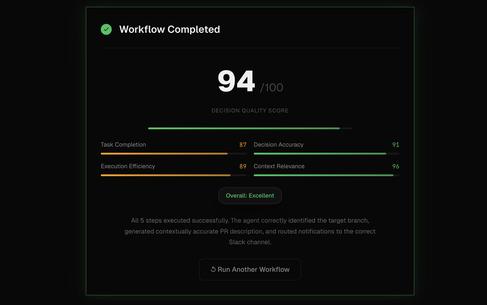
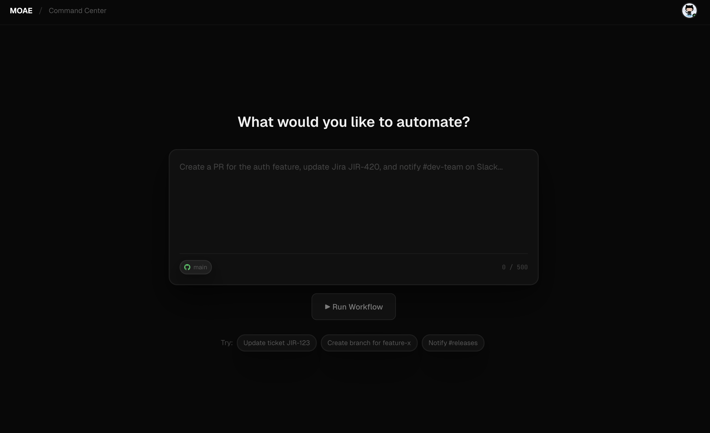
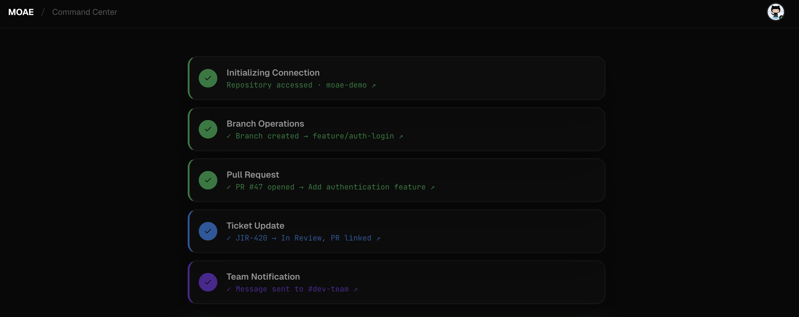

# 🚀 MOAE — Multi-Agent Orchestration Engine  

## 📌 Overview  
MOAE is an AI-powered system that automates developer workflows across tools like GitHub, Jira, and Slack using a single natural language command. Instead of manually performing repetitive coordination tasks—such as deploying code, updating tickets, and notifying teams—the system intelligently handles everything end-to-end through collaborating AI agents.

---

## 🏗️ System Architecture  
The following diagram shows how a user request flows through the Planner, Executor, and Verifier agents, and how the system interacts with external tools.

  

---

## 💻 Frontend Interface

The dashboard shows user input, execution flow, and real-time updates.

  

  

  

---

## ⚙️ How It Works  
The system operates through three core agents working together:

- **Planner Agent**: Converts a user’s natural language goal into structured steps  
- **Executor Agent**: Executes each step using GitHub, Jira, and Slack APIs  
- **Verifier Agent**: Validates execution results and ensures correctness  

---

## 🛠️ Tech Stack  
- **Backend**: Spring Boot (Java)  
- **Frontend**: React  
- **AI Models**: Mistral 7B
- **APIs**: GitHub, Jira, Slack  

---

## 📊 Example Workflow  
**Input:**  
"Deploy the new feature and notify the team"  

**Execution:**  
1. Planner creates step-by-step plan  
2. Executor triggers deployment, updates Jira, sends Slack message  
3. Verifier checks if all steps succeeded  

**Output:**  
- Deployment successful  
- Jira updated  
- Team notified  

---

## Contributors
- @rishankgupta567@gmail.com

---

## Contact me
- @disharaathore@gmail.com